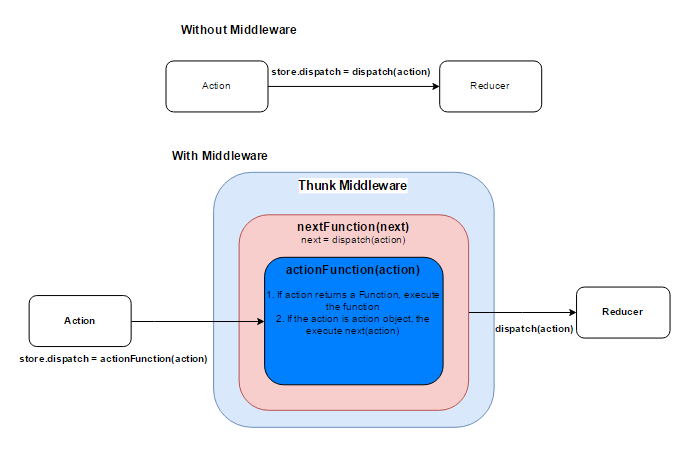

layout: true

.signature[@algogrit]

---

class: center, middle

# Redux: Saga vs Thunk

Gaurav Agarwal

---

# Agenda

* Audience poll
* Refresher on redux
* Thunk approach
* Brief intro to ES9 features
* Saga approach
* Comparison with Vuex
* Redux in the land of GraphQL

---

class: center, middle

Software Engineer & Product Developer

Consultant & Trainer @ https://agarwalconsulting.io

ex-Tarka Labs, ex-BrowserStack, ex-ThoughtWorks

---

class: center, middle

# 🙋‍♂️

## How many of you are students or are new to programming?

# 🙋

---

class: center, middle

# 🙋‍♂️🙋

## How many of you are familiar or have worked with React/Redux?

# 🙋🙋‍♂️

---

class: center, middle

# 🙋🙋‍♂️

## How many of you use React **without** ~~Redux~~?

# 🙋‍♂️🙋

---

class: center, middle

# Quick refresher on Redux

---

class: center, middle

.image-credits[Rodrigo F. Fernandes]

---

class: center, middle

# So, if this is Redux, then what does Thunk do?

---

class: center, middle

.image-credits[Gethyl George Kurian]

---

class: center, middle

Code?!

---

class: center, middle

PLACEHOLDER - Thunk flow

---

class: center, middle

# Brief intro to ES9

---

class: center, middle

Async / await

---

class: center, middle

Generators in action

---

class: center, middle

# What is Saga about?

---

class: center, middle

PLACEHOLDER - Saga flow

---

# Why Saga (*highly opinionated points*)

- Simple, easy to reason approach
- Debugging

---

class: center, middle

# Comparison with Vuex

---

class: center, middle

---

class: center, middle

It looks the same?!

---

class: center, middle

PLACEHOLDER - Differences

---

class: center, middle

# Redux in the land of GraphQL

---

class: center, middle

PLACEHOLDER - Or rather how does GraphQL simplify the redux lifecycle and state management

---

# References

- [How GraphQL replaces Redux](https://hackernoon.com/how-graphql-replaces-redux-3fff8289221d)

- PLACEHOLDER - Add other references

---

class: center, middle

Code
https://github.com/algogrit/presentation-redux-saga-vs-thunk

Slides
https://redux-saga-vs-thunk.slides.algogrit.com
